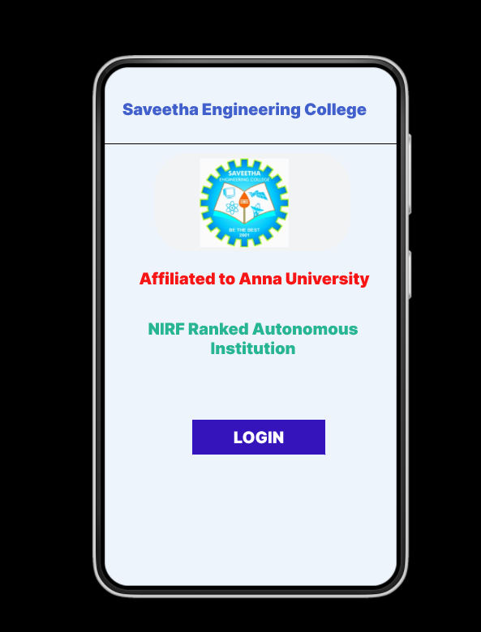
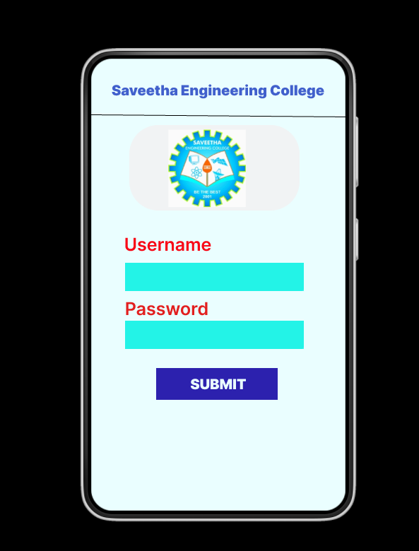
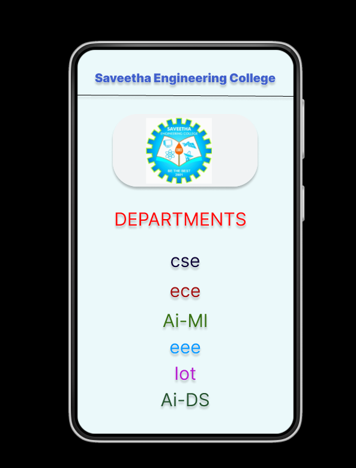

# Event Registration Web Application

## AIM:
To design, develop and deploy a web application for event registration.

## DESIGN STEPS:

### Step 1:
Create a new frame.

### Step 2:
Select any one preset size of your choice.

### Step 3:
Select the shapes you need.

### Step 4:
Import images as needed.

### Step 5:
Create pages based on your need and link them.

### Step 6:

Validate the HTML and CSS code.

### Step 6:

Publish the website in the given URL.

## DESIGN TOOL:
Figma

## CODE:
```

/* Home Page */

position: relative;
width: 360px;
height: 640px;
background: #EEF4FC;
box-shadow: 0px 4px 4px rgba(0, 0, 0, 0.25);

/* Login Page */

position: relative;
width: 360px;
height: 640px;
background: #EAFEFF;
box-shadow: 0px 4px 4px rgba(0, 0, 0, 0.25);

/* LOGIN */

position: absolute;
width: 130px;
height: 24px;
font-family: 'Inter';
font-style: normal;
font-weight: 900;
font-size: 20px;
line-height: 24px;
text-align: center;
color: #FFFFFF;
text-shadow: 0px 4px 4px rgba(0, 0, 0, 0.25);

/* Saveetha Engineering College */

position: absolute;
width: 307px;
height: 43px;
left: 26px;
top: 35px;
font-family: 'Inter';
font-style: normal;
font-weight: 900;
font-size: 20px;
line-height: 24px;
text-align: center;
color: #4160CC;
text-shadow: 0px 4px 4px rgba(0, 0, 0, 0.25);


/* Line 3 */

position: absolute;
width: 360.01px;
height: 0px;
left: 0px;
top: 76px;
border: 1px solid #000000;
box-shadow: 0px 4px 4px rgba(0, 0, 0, 0.25);
transform: rotate(0.31deg);

/* saveethalogo 2 */

position: absolute;
width: 241px;
height: 121px;
left: 59px;
top: 107px;
background: url(saveethalogo.png);
filter: drop-shadow(0px 4px 4px rgba(0, 0, 0, 0.25));
border-radius: 41px;

/* DEPARTMENTS */

position: absolute;
width: 291px;
height: 33px;
left: 26px;
top: 264px;
font-family: 'Inter';
font-style: normal;
font-weight: 400;
font-size: 30px;
line-height: 36px;
text-align: center;
color: #FF0B0B;
text-shadow: 0px 4px 4px rgba(0, 0, 0, 0.25);

/* cse */

position: absolute;
width: 291px;
height: 33px;
left: 34px;
top: 333px;
font-family: 'Inter';
font-style: normal;
font-weight: 400;
font-size: 30px;
line-height: 36px;
text-align: center;
color: #0E0435;
text-shadow: 0px 4px 4px rgba(0, 0, 0, 0.25);

/* ece */

position: absolute;
width: 291px;
height: 33px;
left: 34px;
top: 383px;
font-family: 'Inter';
font-style: normal;
font-weight: 400;
font-size: 30px;
line-height: 36px;
text-align: center;
color: #A31111;
text-shadow: 0px 4px 4px rgba(0, 0, 0, 0.25);


/* Ai-Ml */

position: absolute;
width: 291px;
height: 33px;
left: 34px;
top: 433px;
font-family: 'Inter';
font-style: normal;
font-weight: 400;
font-size: 30px;
line-height: 36px;
text-align: center;
color: #387214;
text-shadow: 0px 4px 4px rgba(0, 0, 0, 0.25);

/* Iot */

position: absolute;
width: 291px;
height: 33px;
left: 34px;
top: 521px;
font-family: 'Inter';
font-style: normal;
font-weight: 400;
font-size: 30px;
line-height: 36px;
text-align: center;
color: #B61ECF;
text-shadow: 0px 4px 4px rgba(0, 0, 0, 0.25);

/* eee */

position: absolute;
width: 291px;
height: 33px;
left: 34px;
top: 477px;
font-family: 'Inter';
font-style: normal;
font-weight: 400;
font-size: 30px;
line-height: 36px;
text-align: center;
color: #0B98FF;
text-shadow: 0px 4px 4px rgba(0, 0, 0, 0.25);


/* Ai-DS */

position: absolute;
width: 291px;
height: 33px;
left: 34px;
top: 565px;
font-family: 'Inter';
font-style: normal;
font-weight: 400;
font-size: 30px;
line-height: 36px;
text-align: center;
color: #275531;
text-shadow: 0px 4px 4px rgba(0, 0, 0, 0.25);
```
## OUTPUT:





## RESULT:
The program to design, develop and deploy a web application for event registration is completed successfully.